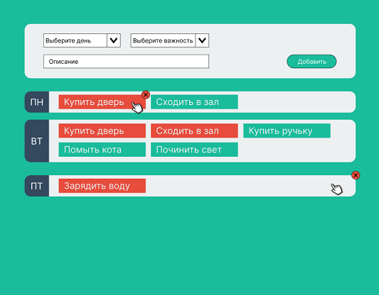
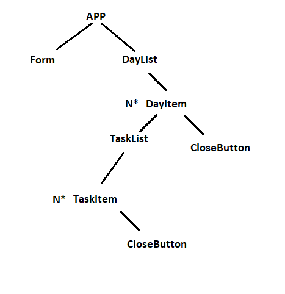

## [link on project Diary](https://sl101.github.io/TEL-RAN_REACT-hw)

## Задача:

Используя библиотеку React, необходимо сверстать макет согласно макету.

На странице необходимо реализовать:

1. Добавление новой задачи (дата, имя, важность). Важность определяется типами: важно или неважно
2. Процесс, который будет сортировать задачи по дням недели (пнд-вск)
3. Возможность удалять как список задач (день недели), так и одну задачу

Требование к работе:

1. Приложение должно соответствовать макету с точки зрения стилизации
2. В работе должен соблюдаться паттерн проектирования (файлы, стилизация)
3. Работа должна быть опубликована на:
   a) github репозитории
   b) на github pages (разобрать что это и как этим пользоваться)

Примечание:

1. В работе весь функционал должен быть реализован используя uesState
2. Ссылка на github pages должна находиться в файле index.js (или в README)

Полезная литература:
https://developer.mozilla.org/en-US/docs/Web/HTML/Element/input
https://blog.logrocket.com/deploying-react-apps-github-pages/

Срок выполнения : 2 недели
До 05.03.2023

Схема компонентов:

