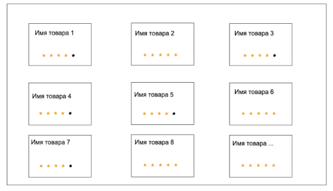
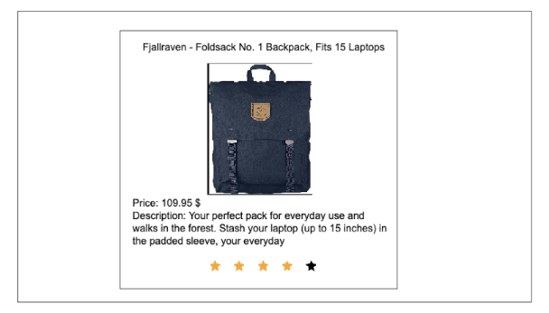

## [link on project Fake store](https://sl101.github.io/TelRan-fake-store)

## Задача:

Задан API, который ссылается на список всех товаров в неком магазине
let url = 'https://fakestoreapi.com/products'
Используя роутинг, необходимо реализовать 2 страницы по следующим макетам

1 страница. Список всех товаров.
Данная страница должна в виде списка выводить все товары по примеру:

1. Все товары должны быть доступны по ссылке /products
2. Стилизация элементов может быть произвольной (grid-template). В работе не предусмотрены header, footer
3. В качестве описания блока необходимо взять имя товара (см запрос). Имя каждого товара должно перенаправлять на ссылку /product/{id}
4. Для каждого товара на данной странице необходимо предусмотреть его рейтинг в виде звезд. Для этого предусмотрите 1 отдельный компонент, который получает необходимый prop
   Обратите внимание на то, что рейтинг представляется в виде дробного числа. Его необходимо округлить по правилам математики.

2 страница. Описание товара
Данная страница должна содержать полную информацию о товаре по следующему примеру:

1. Стилизация элементов может быть произвольной. (Порядок элементов должен остаться как на макете)
2. Страница должна быть доступна по ссылке /product/{id}
3. При переходе на страницу должна выводиться информация конкретного товара
4. На этой странице также необходимо реализовать рейтинг в виде звезд.

Примечание:

1. Имейте ввиду, что после запуска проекта вы будете переходить на домашнюю страницу. Если хотите усложнить работу - можете добавить хедер с навигационным линком на страницу /products
   В противном случае необходимо данный путь прописывать вручную в адресной строке
2. Ссылка на github pages будет огромным плюсом, но с роутингом будут проблемы. Для ее решения необходимо вместо BrowserRouter использовать HashRouter (ограничения gh-pages)
3. Стилизация элементов остается на ваше усмотрение, но согласно сухому макету.
4. Не забудьте перед решением установить библиотеку:
   npm i react-router-dom
