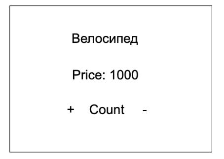

- [link on project](https://sl101.github.io/TelRan-products)

Задан объект внутри компонента App:

<code>const data = [
{id: 1, name: 'Велосипед', price: 1000, count: 1},
{id: 2, name: 'Самокат', price: 700, count: 1},
{id: 3, name: 'Ролики', price: 1300, count: 2},
{id: 4, name: 'Сноуборд', price: 19000, count: 4}
]</code>

Необходимо создать компонент ProductItem, который будет отображать данные товара по следующему макету:

Расположение компонентов (стилизация) остается по желанию.

Задание: используя хук useState() необходимо добиться следующего функционала:

1. Добавления нового товара с указанием имени, цены и количества (через модальное окно prompt()). Предварительно необходимо создать кнопку button для этой операции

2. У каждого выводимого товара должны быть кнопки (+,-) которые будут менять сво-во count только у нажатого товара по правилам икнремента/декремента

3. Реализовать удаление определенного товара. Вместо фактической кнопки можно повесить на каждый div-элемент событие onDoubleClick
