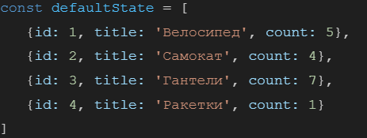
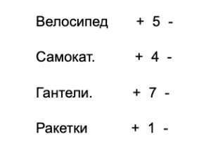

## [link on project](https://sl101.github.io/TelRan-shopbasket)

## Задача:

Используя redux, необходимо реализовать аналог работы корзины.
В качестве исходных данных задан макет (ориентировочный) и defaultState:

Макет:

Для каждого выводимого товара необходимо реализовать кнопки + -, который будут менять значение count уникально для каждого товара.

Требование к работе:

1. Стилизация приложения может быть произвольной (по макету).
2. Работа должна быть выполнена используя библиотеку redux. В качестве defualtState необходимо взять заготовленный выше массив.
3. Приветствуется публикация проекта на gh-pages

Доп задание (\*):

1. Реализуйте проверку, которая будет ограничивать значение count от 1 до 25 (включительно)
2. Реализуйте кнопку, которая будет добавлять новый элемент в корзину, указав дефолтное значение для count - 1, для id - либо автоинкремент, либо любое уникальное значение. Имя товара можно брать с результата работы prompt()
3. Реализуйте удаление элемента корзины только в том случае, если значение count будет меньше 1 (то есть 0)
